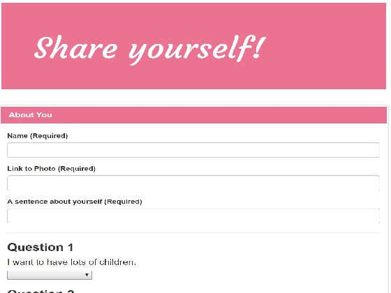
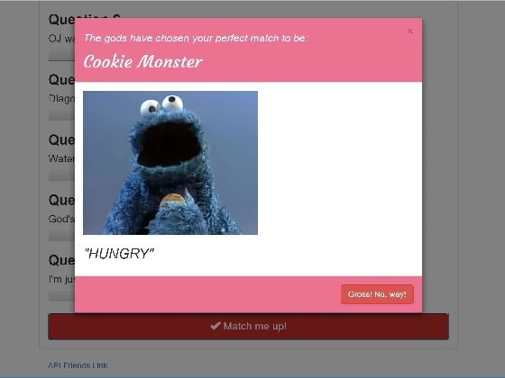

# Express and Node app "Friend Finder"

### A dating app that uses Express to handle routing where a user's survey is used to determine their 'best match' from other dummy or user submitted surveys.
## [Link to Live Heroku Page](https://lit-scrubland-21785.herokuapp.com/)
------------------------------------------------------------------------------------------

Friend Finder uses GET and POST routes to send and retrieve data to and from different pages and files.  
After the user sumbits a survey, the scores from it are compared against the scores from all the other stored surveys in the app, hosted by Heroku. 

------------------------------------------------------------------------------------------

A modal will then let the user know who the best match was, according to the survey scores. That user's survey and information will then be available for comparison against further surveys.

------------------------------------------------------------------------------------------

## To Install
* Git Clone the repository
* Navigate to the folder where the repository exists using Git Bash or Terminal.
* Run the command `npm install` to download the required dependencies.
* Then run the command `node .\server.js` to start a local host server.

### Languages & Programs Used
  * JavaScript
  * jQuery
  * Nodejs
  * Express

### Required Node packages and other sources
* [express]
* [body-parser]
* [path]
